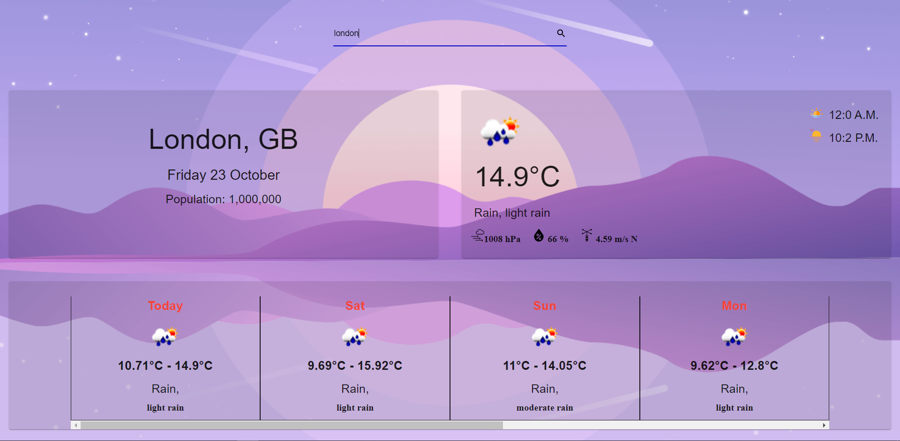

---

# React Weather Application 
## Find the current weather and 7 days forecast of any city on earth with this simple little web app.

Live Demo on [Netlify](https://monitor-weather.netlify.app).

---

Simple React web application written with jsx that returns the current weather. The app utilizes:

- OpenWeatherMap's API,
- OpenWeatherMap's icons for weather icons,  
- create-react-app tool,
- Axios for easy http requests,
- Material-ui for styling and design.